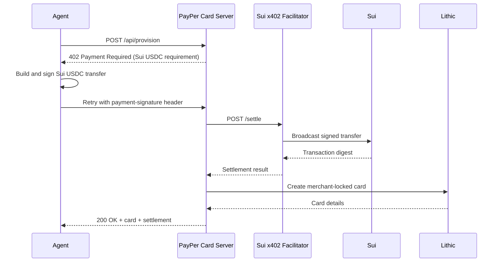

# PayPer Card on Sui

PayPer Card provisions a Lithic virtual card after a Sui USDC payment clears through an x402-style HTTP 402 flow.

The protected product endpoint is `POST /api/provision`. A client calls it normally, receives a `402 Payment Required` response, signs a Sui USDC transfer, retries with the payment payload, and gets a merchant-locked Lithic card after settlement. The visual demo route, `POST /api/demo/run-agent`, uses the configured funded Sui account directly so judges can see the end-to-end card flow without wiring a browser wallet.

## What Changed for Sui

- Uses `x402-sui` for the programmatic HTTP 402 buyer/seller loop.
- Uses `@mysten/sui` for direct Sui wallet settlement in the visual demo.
- Defaults to Circle native USDC on Sui testnet:
  `0xa1ec7fc00a6f40db9693ad1415d0c193ad3906494428cf252621037bd7117e29::usdc::USDC`
- Supports mainnet with Circle native USDC:
  `0xdba34672e30cb065b1f93e3ab55318768fd6fef66c15942c9f7cb846e2f900e7::usdc::USDC`
- Defaults the facilitator URL to `https://x402.blockeden.xyz`, overrideable with `X402_FACILITATOR_URL`.

## Flow



## Environment

Create `.env` in the repo root:

```bash
PORT=3001
SUI_NETWORK=testnet
SUI_PRIVATE_KEY=suiprivkey1...
SUI_WALLET_ADDRESS=0x...
X402_PAY_TO_ADDRESS=0x...
X402_FACILITATOR_URL=https://x402.blockeden.xyz
X402_FACILITATOR_API_KEY=...

# Optional overrides
SUI_RPC_URL=https://fullnode.testnet.sui.io:443
SUI_USDC_COIN_TYPE=0xa1ec7fc00a6f40db9693ad1415d0c193ad3906494428cf252621037bd7117e29::usdc::USDC
X402_MAX_TIMEOUT_SECONDS=300

# Lithic sandbox
LITHIC_API_KEY=...
```

For testnet, fund the Sui wallet with SUI for gas and Circle testnet USDC. For mainnet, set `SUI_NETWORK=mainnet` and use the mainnet USDC coin type or omit `SUI_USDC_COIN_TYPE` to use the built-in default.

## Run Locally

```bash
npm install
npm run wallet:info
npm start
```

Open:

- Home: http://localhost:3001/
- Visual demo: http://localhost:3001/demo
- Resources: http://localhost:3001/resources

Run the Sui x402 CLI buyer:

```bash
npm run agent
```

## API

- `POST /api/provision`: x402-protected Sui USDC route. Requires a Sui payment through the `payment-signature` retry flow.
- `POST /api/demo/run-agent`: direct demo settlement from the configured Sui keypair, then Lithic card creation.
- `GET /api/cards`: in-memory list of cards provisioned during this server process.

## Deployment Notes

- Set `X402_PAY_TO_ADDRESS` to the Sui address that should receive USDC.
- Keep `SUI_PRIVATE_KEY` server-side only. The visual demo uses it for simulated settlement.
- If using BlockEden, configure `X402_FACILITATOR_URL=https://x402.blockeden.xyz` and `X402_FACILITATOR_API_KEY` or `BLOCKEDEN_API_KEY`.
- The current demo stores provisioned card metadata in memory. Use persistent storage before production use.
