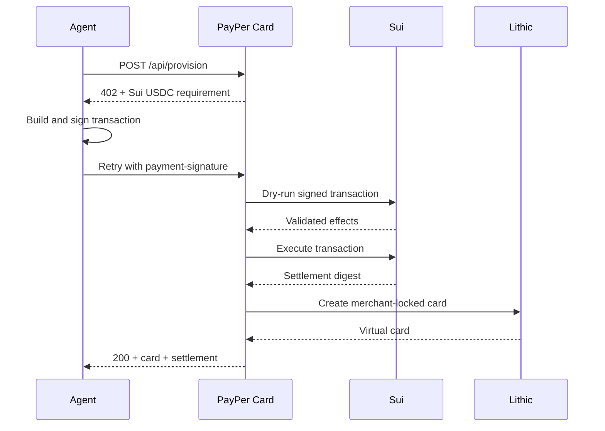

# PayPer Card

PayPer Card gives AI agents controlled access to the card economy using Sui USDC. An agent requests a merchant and spending limit, completes an HTTP 402 payment challenge, and receives a merchant-locked Lithic virtual card after the signed payment settles on Sui.

Every purchase is bounded by an explicit amount and merchant, while the Sui transaction provides an auditable settlement receipt.

## Product Flow

1. An agent calls `POST /api/provision` with a merchant and USDC amount.
2. PayPer Card returns `402 Payment Required` with Sui USDC payment requirements.
3. The x402 client builds and signs the Sui transaction, then retries with a `payment-signature` header.
4. PayPer Card validates the requirement, dry-runs the transaction, and submits it to Sui.
5. After settlement, Lithic creates a merchant-locked virtual card with the approved limit.
6. The response includes the card details and Sui transaction digest.



## Stack

- Next.js App Router and React
- Sui testnet or mainnet
- Circle native USDC on Sui
- x402 v2 payment challenge and retry flow
- Self-facilitated Sui verification and settlement
- Lithic sandbox card issuance
- Vercel deployment

## Sui Assets

Testnet native USDC:

```text
0xa1ec7fc00a6f40db9693ad1415d0c193ad3906494428cf252621037bd7117e29::usdc::USDC
```

Mainnet native USDC:

```text
0xdba34672e30cb065b1f93e3ab55318768fd6fef66c15942c9f7cb846e2f900e7::usdc::USDC
```

## Environment

Copy `.env.example` to `.env` and configure:

```bash
PORT=3000
API_URL=http://localhost:3000

SUI_NETWORK=testnet
SUI_RPC_URL=https://fullnode.testnet.sui.io:443
SUI_PRIVATE_KEY=suiprivkey1...
SUI_WALLET_ADDRESS=0x...
X402_PAY_TO_ADDRESS=0x...
SUI_USDC_COIN_TYPE=

X402_FACILITATOR_MODE=self
X402_MAX_TIMEOUT_SECONDS=300

LITHIC_API_KEY=...
```

`X402_FACILITATOR_MODE=self` validates and broadcasts the signed transaction from the Next.js API route. To use a hosted facilitator, set the mode to `external` and provide `X402_FACILITATOR_URL` and `X402_FACILITATOR_API_KEY`.

Fund the payer wallet with SUI for gas and USDC for settlement. Use a separate treasury address for `X402_PAY_TO_ADDRESS` when testing real value transfer.

## Run Locally

```bash
npm install
npm run check:ready
npm run dev
```

- App: http://localhost:3000
- Visual demo: http://localhost:3000/demo
- Resources: http://localhost:3000/resources

Run the autonomous x402 buyer:

```bash
npm run agent
```

Inspect the configured wallet:

```bash
npm run wallet:info
```

## API

### `POST /api/provision`

The production x402 route. It returns a Sui USDC payment challenge, accepts the signed retry, settles the transaction, and provisions a card.

### `POST /api/demo/run-agent`

The visual demo route. It executes settlement with the configured server-side Sui account and returns the resulting Lithic card.

### `GET /api/cards`

Returns card records created during the current server process. The demo uses in-memory storage; production deployments should use encrypted persistent storage and strict access controls.

## Deploy to Vercel

1. Import the repository as a Next.js project.
2. Add the environment variables from `.env.example` in Vercel Project Settings.
3. Keep `SUI_PRIVATE_KEY` and `LITHIC_API_KEY` server-side.
4. Deploy using the included `vercel.json` configuration.

The settlement routes use the Node.js runtime with a 60-second execution window for Sui confirmation and card provisioning.
